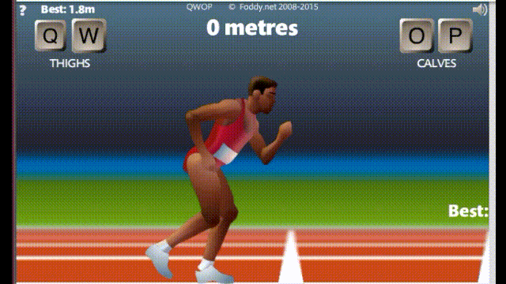
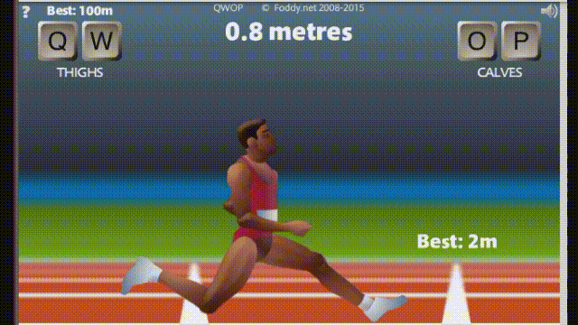
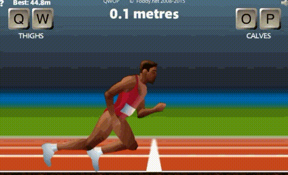

# Play QWOP with Reinforcement Learning Actor-Critic(AC) Agents Using Tensorflow 2

[](./LICENSE) [](https://www.python.org/)



Let's use reinforcement learning to play a popular game [QWOP](http://www.foddy.net/Athletics.html)!

My friend introduced me to this game and I was thinking if there is a way to use deep learning to play. So, this repository was created.

I surveyed some ways to build game gym and the model. You can find the methods I chose in [References](#References).

## Introduction

Reinforcement learning requires an environment, which is sometimes called **gym**.

Then, depending on the actions chose by **agents**, the environment will give back. That is, the **reward mechanism**.

### Gym

`Selenium` is used to simulate a browser to open the game and use `pynput` to control keyboard input.

### Reward Mechanism

The reward is the score on the screen and I obtain it from the screen shot by using `Tesseract OCR`.

And, the mechanism depends on the following two items.

- Increase in meters

- Makes a decision in a short time

### Agent

In the agent part, I use `Actor-Critic(AC) Agents` with `Convolution Neural Network` model.

## Requirements

`pip install -r requirements.txt`

- tensorflow==2.0.0
- tqdm
- selenium
- pytesseract
- pynput
- numpy
- opencv-python

There are other things you need to prepare or know.

- Chrome driver

  If you're not using `Ubuntu` or `linux-based OS` with version `79.0.3945.36` of chrome, you need to obtain chrome driver from [here](https://chromedriver.chromium.org/downloads). And you need to specific the path by using flag `--chrome_driver_path`.

- Pytesseract OCR

  Python-tesseract is a wrapper for Google’s Tesseract-OCR Engine. You can find more details from [pytesseract](https://pypi.org/project/pytesseract/). I use this to distingush number and the default language of Tesseract-OCR engine is English. I'm not sure whether using other Language will affect the results or not. If you're interesting on it, you can give a try.

## Usage

### Demo

You can only test with the pretrained-model, but it may make some mistakes. ;)

`python main.py --train False --model_path ./model/model.h5`

### Flags

```
usage: main.py [-h] [--train TRAIN] [--model_path MODEL_PATH]
               [--model_save_path MODEL_SAVE_PATH] [--test_env TEST_ENV] [--chrome_driver_path CHROME_DRIVER_PATH]
```

> `--train`: Training the model. The input should be either "True" or "False".

> `--model_path`: Model weights path. If you assign a path, the model will load the weights.

> `--model_save_path`: Model save path. If you have not specific, the model won't be saved.

> `--test_env`: Use random action to test QWOP environment. The input should be either "True" or "False".

> `--chrome_driver_path`: Specific your chrome driver path to run the selenium.

## Results

- The test result!


- Testing process



- Funny case



## Issues

The custom layer may cause `WARNING:  AssertionError: Bad argument number for Name: 3, expecting 4`.

You can fix it by following solution. [Here](https://github.com/tensorflow/autograph/issues/1#issuecomment-545857979)

```bash
pip install --user gast==0.2.2
```

## Conclusion

Although this method allowed him to reach the goal, it seemed a bit slow.

If you want to speed up, there may be some directions that need to be improved.

Such as a method like Gym from OpenAI can have immediate feedback. In this way, we do not need to use a simulated browser to obtain data. And, the information obtained is more accurate and detailed.

There is also something like training the model with positions from the charater. This may also make the effect better.

## Refferences

[juanto121/qwop-ai](https://github.com/juanto121/qwop-ai)

[Deep Reinforcement Learning with TensorFlow 2.1](https://github.com/inoryy/tensorflow2-deep-reinforcement-learning)
